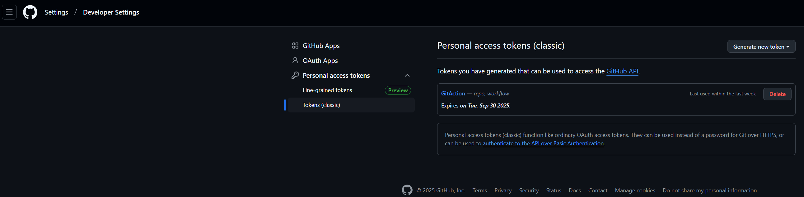
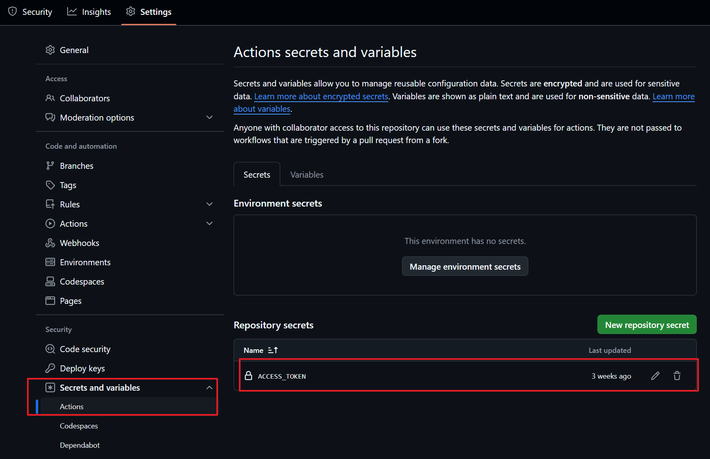
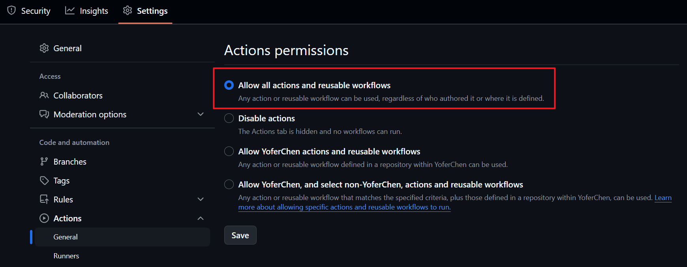
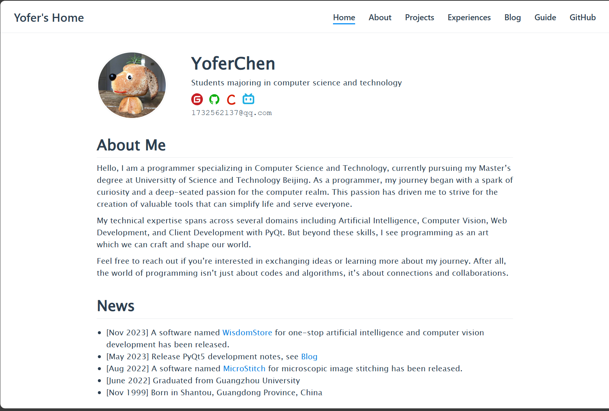
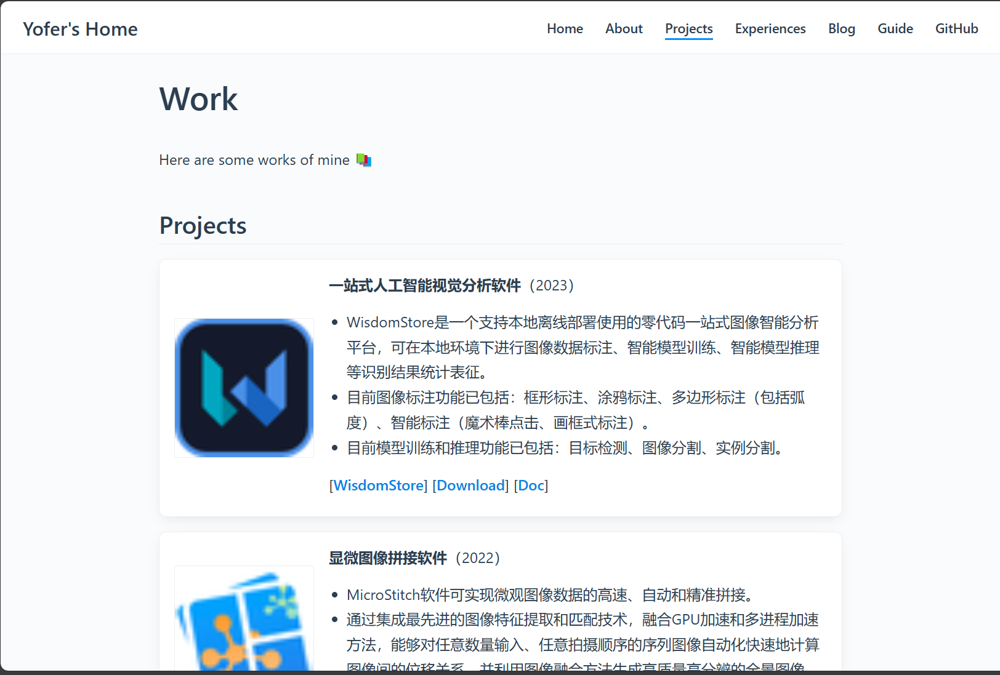
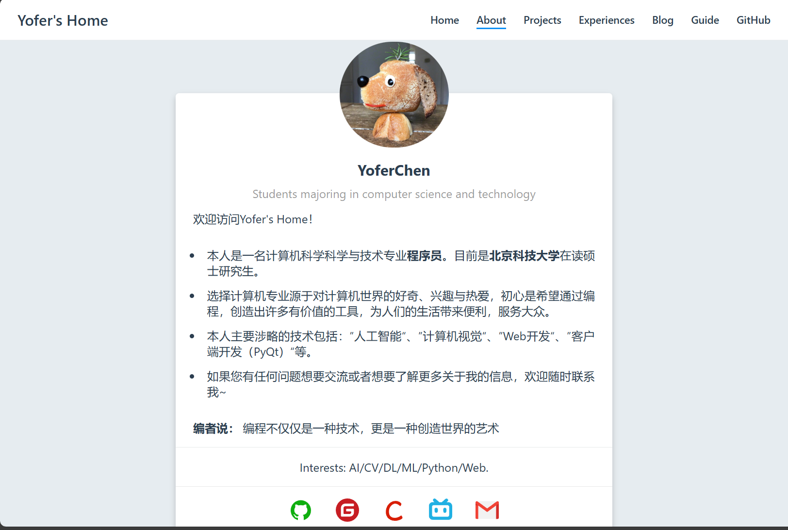
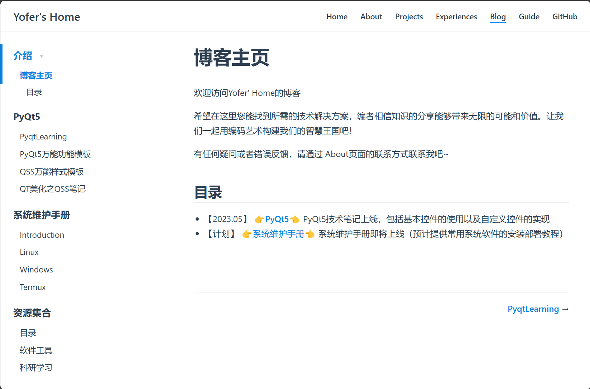

<h1 align="center">
  <a href="./docs/.vuepress/public/home/Readme.png" title="Homepage">
    
  </a>
  <br />
  Yofer's Home power by VuePress
</h1>

<p align="center">
  Build your site like a Pro :v:
</p>

<p align="center">
  
  
</p>

## The project is based on [vuepress-homepage](https://github.com/imfing/vuepress-homepage)

## [Go to Home Page](https://yoferchen.github.io/YoferVuePressHome/)

Click the title to enter the website.


<h2>
  <a href="https://yoferchen.github.io/YoferVuePressHome/guide/" target="_blank" title="Getting Started">
    Getting Started
  </a>
</h2>

Check the full documentation here :point_right: [Guide](https://vuepress-homepage.netlify.com/guide/)

Make sure you have [Node.js](https://nodejs.org) and [yarn](https://yarnpkg.com) installed.

```bash
# Clone the repo
git clone https://github.com/YoferChen/YoferVuePressHome.git
cd YoferVuePressHome

# Install VuePress
yarn global add vuepress

# Install dependencies
yarn

# Run
yarn dev

# Build [Optional]
yarn build
```

Check your site at `http://localhost:3000/YoferVuePressHome/`

## Notice
1. Please refer to the resource file using the relative path of `./XXX.png` insteaf of `XXX.png`. (Recommand)
2. Please use the absolute path of `/base_url/XXX.png` to reference the resource file, base_url correspond to the base setting in `docs/.vuepress/config.js`. For example:  `/YoferVuePressHome/home/Readme.png`

## Deploy
### 1. Manual
```bash
yarn build

cd dist
git init
git add .
git commit -m deploy
# Upload the dist to branch of blog-pages
git push -f git@github.com:YoferChen/YoferVuePressHome.git master:blog-pages
```
### 2. Automated Deployment with Git Actions
> This project already supports automatic deployment of Git Actions to Git Pages

- Create Personal Access Tokens

- Add Access Token for Repository

- Enable Git Action


<br/>

## Screenshots:

| Home/Resume :newspaper: | Projects/Publications :books: |
| :---: | :---: |
|  |  |

| About Me :raising_hand: | Docs/Articles :closed_book: |
| :---: | :---: |
|  |  |


## Credit

[VuePress](https://vuepress.vuejs.org/): Vue-powered Static Site Generator

[Vue.js](https://vuejs.org/): The Progressive JavaScript Framework

## License

Copyright © 2025, YoferChen

Released under the [MIT License](https://opensource.org/licenses/MIT).
