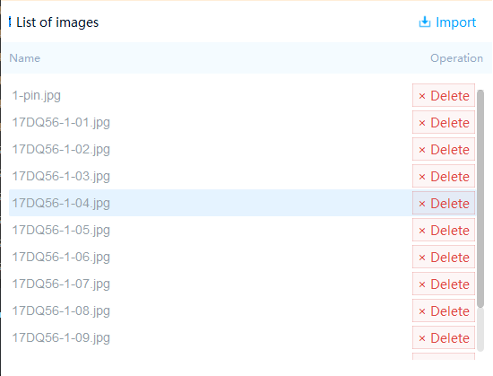
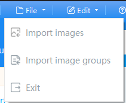
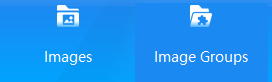
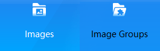
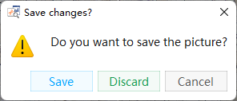

# 常用QSS样式表

[toc]


## 滚动条

```python
# 设置滚动条样式：https://blog.csdn.net/h595636059/article/details/78415662
Style_QScrollBar = '''
    QScrollBar:vertical
    {
        width:8px;
        background:rgba(0,0,0,0%);
        margin:0px,0px,0px,0px;
        padding-top:9px;  
        padding-bottom:9px;
    }
    QScrollBar::handle:vertical
    {
        width:8px;
        background:rgba(0,0,0,25%);
        border-radius:4px;  
        min-height:20;
    }
    QScrollBar::handle:vertical:hover
    {
        width:8px;
        background:rgba(0,0,0,50%); 
        border-radius:4px;
        min-height:20;
    }
    QScrollBar::add-line:vertical 
    {
        height:9px;width:8px;
        border-image:url(:/images/a/3.png);
        subcontrol-position:bottom;
    }
    QScrollBar::sub-line:vertical 
    {
        height:9px;width:8px;
        border-image:url(:/images/a/1.png);
        subcontrol-position:top;
    }
    QScrollBar::add-line:vertical:hover 
    {
        height:9px;width:8px;
        border-image:url(:/images/a/4.png);
        subcontrol-position:bottom;
    }
    QScrollBar::sub-line:vertical:hover
    {
        height:9px;width:8px;
        border-image:url(:/images/a/2.png);
        subcontrol-position:top;
    }
    QScrollBar::add-page:vertical,QScrollBar::sub-page:vertical 
    {
        background:rgba(0,0,0,10%);
        border-radius:4px;
    }

'''
```



## 下拉菜单

```python
# 下拉菜单：
# https://blog.csdn.net/p942005405/article/details/104669765
# https://blog.csdn.net/WODEDAHUA/article/details/105157826
Style_QComboBox = '''
    /* 下拉后，整个下拉窗体样式 */
    QComboBox QAbstractItemView {
        background-color: white;   /* 整个下拉窗体的背景色 */
        font-family: "Microsoft YaHei";
        font-weight: 400;
        font-size: 14px;
        text-align: left;
        color: #00152a;
    }
    QComboBox::drop-down{
        margin-top:17px;
        image: url(:/箭头.png);
    }
    QComboBox QAbstractItemView::item {
        height: 32px;
    }
'''
```



## 按钮selected、unselected、hover

```python
# 图像拼接/图像组拼接按钮
Style_Btn_Selected = '''
QToolButton{
    width: 130px;
    height: 79px;
    background-color:#1B89F2;
    opacity: 0.8;
    border:0px;
    font-family: "Microsoft YaHei";
    font-weight: 400;
    font-size: 14px;
    text-align: left;
    color: #fff;
}
::hover{
    background-color:rgba(27, 137, 242,0.7);
    border:none;
    color: black;
}
'''

Style_Btn_Unselected = '''
QToolButton{
    width: 130px;
    height: 79px;
    opacity: 0.8;
    border:0px;
    font-family: "Microsoft YaHei";
    font-weight: 400;
    font-size: 14px;
    text-align: left;
    color: #fff;
}
::hover{
    background-color:rgba(27, 137, 242,0.7);
    border:none;
    color: black;
}
'''

Style_Btn_Hover = '''
    QPushButton{
        color:white;
    }
    ::hover{  /*QPUshButton和QToolButton通用*/
        background-color:#008BD9;
        opacity: 0.8;
        border:none;
        color: black;
    }
'''
```



## 不同状态按钮

```python
style_true = '''
            width: 76px;
            height: 24px;
            background: rgba(0, 164, 255, 0.05);
            border: 1px solid rgba(0, 164, 255, 0.2);
            font-family: "Microsoft YaHei";
            font-weight: 400;
            font-size: 14px;
            color: #00a4ff;
            text-align:center; 
'''
style_false = '''
    width: 76px;
    height: 24px;
    background: rgba(26, 155, 82, 0.05);
    border: 1px solid rgba(26, 155, 82, 0.2);
    font-family: "Microsoft YaHei";
    font-weight: 400;
    font-size: 14px;
    color: #1a9b52;
    text-align:center; 
'''
style_cancel = '''
    width: 76px;
    height: 24px;
    background: rgba(80, 80, 80, 0.05);
    border: 1px solid rgba(80, 80, 80, 0.2);
    font-family: "Microsoft YaHei";
    font-weight: 400;
    font-size: 14px;
    color: #5a5a5a;
    text-align:center; 
'''
```



## 不同状态标签

```python
Style_Label_Stitch_Successfully = '''
    font-family: "Microsoft YaHei";
    font-weight: 400;
    font-size: 14px;
    text-align: center;
    color: #1a9b52;
    margin-left:5px;
    background-color:transparent;
'''

Style_Label_Stitch_Error = '''
    font-family: "Microsoft YaHei";
    font-weight: 400;
    font-size: 14px;
    text-align: center;
    color: #de4743;
    margin-left:5px;
    background-color:transparent;
'''
```